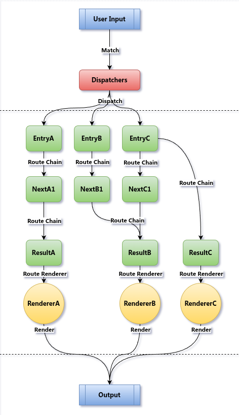

<p align="center">
    <a href="https://github.com/CatilGrass/mingling">
        
    </a>
</p>
<h1 align="center">Mìng Lìng - 命令</h1>

<p align="center">
    The Rust CLI Framework
</p>
<p align="center">
	 
	<a href="https://crates.io/crates/mingling">
	  
	</a>
	<a href="https://docs.rs/mingling/0.1.5/mingling/">
	  
	</a>	
	
</p>

> [!WARNING]
>
> **Note**: Mingling is still under active development, and its API may change. Feel free to try it out and give us feedback!
> **Hint**: This note will be removed in version `0.2.0`

## Contents

- [Intro](#intro)
- [Quick Start](#quick-start)
- [Core Concepts](#core-concepts)
- [Project Structure](#project-structure)
- [Example Projects](#example-projects)
- [Next Steps](#next-steps)
- [Roadmap](#roadmap)
- [Unplanned Features](#unplanned-features)
- [License](#license)

## Intro

`Mingling` is a Rust command-line framework. Its name comes from the Chinese Pinyin for "命令", which means "Command".

## Quick Start

The example below shows how to use `Mingling` to create a simple command-line program:

```rust
use mingling::macros::{dispatcher, gen_program, r_println, renderer};

#[tokio::main]
async fn main() {
    let mut program = ThisProgram::new();
    program.with_dispatcher(HelloCommand);

    // Execute
    program.exec().await;
}

// Define command: "<bin> hello"
dispatcher!("hello", HelloCommand => HelloEntry);

// Render HelloEntry
#[renderer]
fn render_hello_world(_prev: HelloEntry) {
    r_println!("Hello, World!")
}

// Fallbacks
#[renderer]
fn fallback_dispatcher_not_found(prev: DispatcherNotFound) {
    r_println!("Dispatcher not found for command `{}`", prev.join(", "))
}

#[renderer]
fn fallback_renderer_not_found(prev: RendererNotFound) {
    r_println!("Renderer not found `{}`", *prev)
}

// Collect renderers and chains to generate ThisProgram
gen_program!();
```

Output:

```
> mycmd hello
Hello, World!
> mycmd hallo
Dispatcher not found for command `hallo`
```

## Core Concepts

Mingling abstracts command execution into the following parts:

1. **Dispatcher** - Routes user input to a specific renderer or chain based on the command node name.
2. **Chain** - Transforms the incoming type into another type, passing it to the next chain or renderer.
3. **Renderer** - Stops the chain and prints the currently processed type to the terminal.
4. **Program** - Manages the lifecycle and configuration of the entire CLI application.

<details>
  <summary>Architecture Diagram (click to expand)</summary>
	<p align="center">
   		<a href="https://github.com/CatilGrass/mingling">
        	
    	</a>
	</p>
</details>

## Project Structure

The Mingling project consists of two main parts:

- **[mingling/](mingling/)** - The core runtime library, containing type definitions, error handling, and basic functionality.
- **[mingling_macros/](mingling_macros/)** - The procedural macro library, providing declarative macros to simplify development.

## Example Projects

- **[`examples/example-basic/`](examples/example-basic/src/main.rs)** - A simple "Hello, World!" example demonstrating the most basic usage of a Dispatcher and Renderer.
- **[`examples/example-picker/`](examples/example-picker/src/main.rs)** - Demonstrates how to use a Chain to process and transform command arguments.
- **[`examples/example-general-renderer/`](examples/example-general-renderer/src/main.rs)** - Shows how to use a general renderer for different data types (e.g., JSON, YAML, TOML, RON).
- **[`examples/example-completion/`](examples/example-completion/src/main.rs)** - An example implementing auto-completion for the shell.

## Next Steps

You can read the following docs to learn more about the `Mingling` framework:

- Check out **[Mingling Examples](examples/)** to learn about the core library.
- Check out **[mingling_macros/README.md](mingling_macros/README.md)** to learn how to use the macro system.

## Roadmap

- [x] core: \[[0.1.4](https://docs.rs/mingling/0.1.4/mingling/)\] General Renderers *( Json, Yaml, Toml, Ron )* 
- [x] core: \[[0.1.5](https://docs.rs/mingling/0.1.5/mingling/)\] Completion *( Bash Zsh Fish Pwsh )*
- [ ] core: \[**0.2.0**\] Parallel Chains
- [ ] \[**0.2.1**\] Helpdoc
- [ ] \[**unplanned**\] Parser Theme
- [ ] ...

## Unplanned Features

While Mingling has several common CLI features that are **not planned** to be directly included in the framework.
This is because the Rust ecosystem already has excellent and mature crates to handle these issues, and Mingling's design is intended to be used in combination with them.

- **Colored Output**: To add color and styles (bold, italic, etc.) to terminal output, consider using crates like [`colored`](https://crates.io/crates/colored) or [`owo-colors`](https://crates.io/crates/owo-colors). You can integrate their types directly into your renderers.
- **I18n**: To translate your CLI application, the [`rust-i18n`](https://crates.io/crates/rust-i18n) crate provides a powerful internationalization solution that you can use in your command logic and renderers.
- **Progress Bars**: To display progress indicators, the [`indicatif`](https://crates.io/crates/indicatif) crate is the standard choice.
- **TUI**: To build full-screen interactive terminal applications, it is recommended to use a framework like [`ratatui`](https://crates.io/crates/ratatui) (formerly `tui-rs`).

## License

This project is licensed under the MIT License. 

See [LICENSE-MIT](LICENSE-MIT) or [LICENSE-APACHE](LICENSE-APACHE) file for details.
